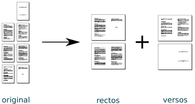
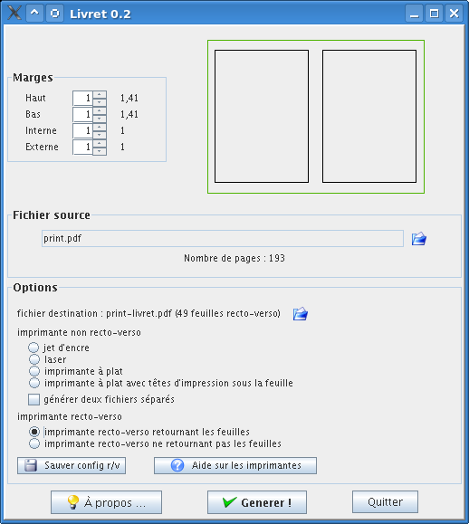

# Livret

## English

Easy transform between many pages PDF doc to a both sides printable mini-book, readable like a book.

## French

Transformer très simplement un fichier PDF en livret (petit livre que l'on peut feuilleter plié en deux).

## Images

## Download and install

### Linux & Mac

[tar file](https://github.com/brunetton/Livret/releases/download/v0.2/livret-0.2-all_inclusive.tar)

Simply untar files, then run `run.sh` from created directory.

=> For Arch users, it seems to exists a Aur package [here](https://github.com/aur-archive/livret)

### Windows

[Windows installer](https://github.com/brunetton/Livret/releases/download/v0.2/setup-livret0.2.exe)

## TODO

  * redo it with a good programming language
